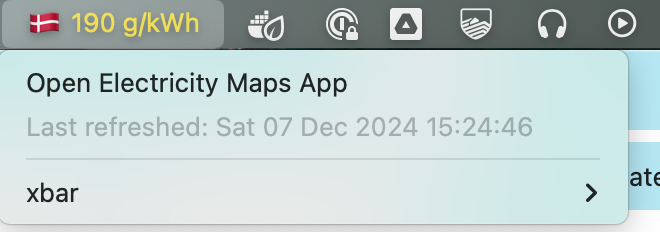
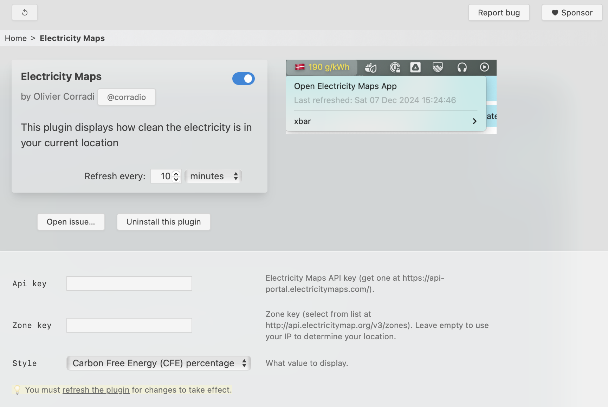

## Install xbar manually
Download and install [version 2.1.7-beta](https://github.com/matryer/xbar/releases/download/v2.1.7-beta/xbar.v2.1.7-beta.dmg) (newer releases can be found [here](https://github.com/matryer/xbar/releases)). If you're using [Homebrew](https://brew.sh), then you can also simply run:

```sh
brew install --cask xbar
```

## Install the Electricity Maps plugin
The Electricity Maps plugin is available [here](https://gist.github.com/corradio/23676994355836817b81d39dce0c9df2) as a Github Gist.
It needs to be downloaded into xbar's plugin folder, and made executable, which can be performed by entering the following commands into a terminal.

```sh
curl https://gist.githubusercontent.com/corradio/23676994355836817b81d39dce0c9df2/raw/001-electricitymaps.5m.py -o ~/Library/Application\ Support/xbar/plugins/001-electricitymaps.5m.py
chmod +x ~/Library/Application\ Support/xbar/plugins/001-electricitymaps.5m.py
```

It's probably also a good idea to ensure your default python installation has the right dependencies installed:

```sh
/Library/Developer/CommandLineTools/usr/bin/python3 -m pip install requests
```

Once you have done this, you should refresh plugins by selecting **xbar > Refresh all**, or pressing the refresh icon. You can configure the plugin by opening it.



The API key can be obtained on the Electricity Maps [free-tier page](https://www.electricitymaps.com/free-tier).
The zone key is optional, and it will default to the location of your device, as determined by your IP address.
You can pick between two styles: either show the carbon intensity (in gCO2e/kWh), or the Carbon-Free Energy (CFE) percentage, being the percentage of low-carbon electricity available.