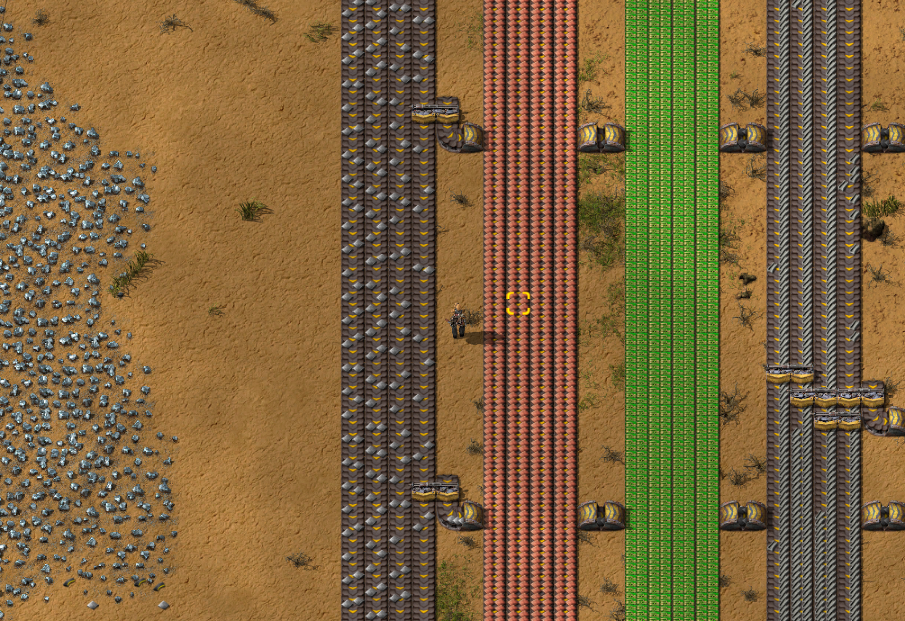
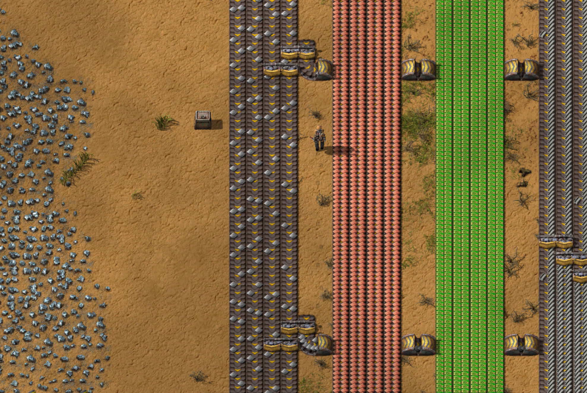
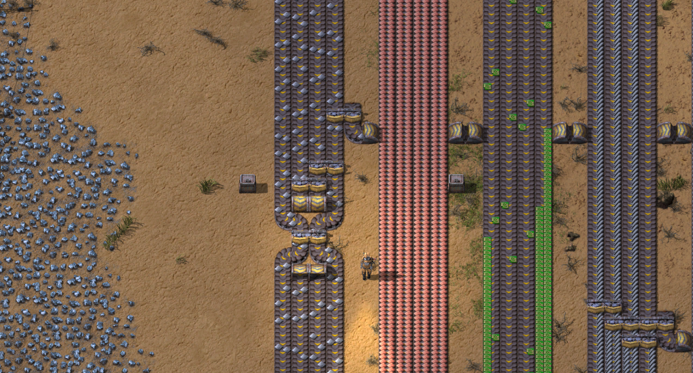
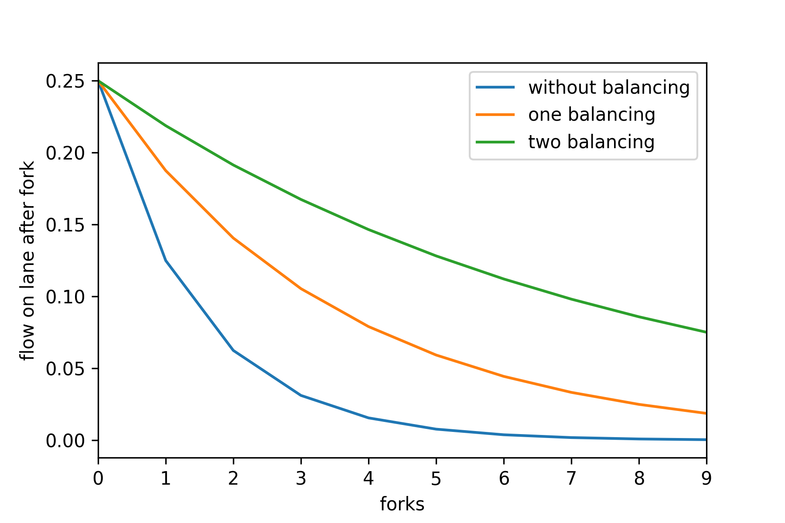

[Factorio](https://factorio.com/) is a game where you build and maintain factories.
As part of the game, you end up routing goods on conveyor belts.
One pattern is to create so-called busses where goods are centralised.
Each bus consists of four lanes where goods flow in one direction.
Factories can then fork the bus lanes to re-route some of the goods from the bus to factories that need it.
But what is the best way to fork these bus lanes to ensure that goods still remain available at the end of the bus?


<p class="figcaption">A screenshot of four main busses in Factorio. Note the leftmost iron plate bus flows from top to bottom and gets forked twice into underground belts that cross the other busses towards the right. A splitter is present at each fork and ensures the flow gets divided into a new lane. Note that the rightmost lane is almost emptied of goods after the two forks.</p>

In order to fork the bus lane, so-called *splitters* are built.
They enforce that the total input flow is distributed evenly across output lanes.

Mathematically, this means that the output flow $\phi_{out}$ on each of the $n_{out}$ output lanes is defined as

$$
\phi_{out} = \frac{1}{n_{out}} \sum_i^{n_{out}}\phi_i,
$$
where $\phi_i$ is the input flow of the $i$-th input (note that it is possible to use splitters with only one input or one output).


When items are needed on either side of the bus for crafting, a fork will be created whereby one lane will be divided in two using a splitter: one output lane will be forked and routed to factories, and one output lane will stay on the bus for later use.
Assuming a nominal flow of 1 item per second for each lane of the bus, the forking operation will result in a division by two of the nominal flow which turns into $\frac{1}{2}$ on the forked lanes.


If the same lane is forked over and over again (as is seen in the previous figure), the flow will drastically reduce as a sequence
of divisions by two with the recurrence relation

$$
\phi(n+1) = \frac{1}{2}\phi(n),
$$

where $n$ is the number of forks. After the $N$-th fork, the flow on the forked lane is therefore

$$
\phi(N) = \frac{1}{2^N}
$$


This series yields $\frac{1}{2}$, $\frac{1}{4}$, $\frac{1}{8}$, $\frac{1}{16}$, $\frac{1}{32}$ ... and will very quickly approach zero at exponential speeds.
In the figure above, it is clearly visible that the number of items on the rightmost lane is drastically reduced after each fork.
It is therefore essential to rebalance the flow to ensure that following forks also use items from the other lanes.


## Rebalancing once
A first idea is to add a splitter which will rebalance the flow after each fork.
Instead of having a remaining flow of $\frac{1}{2}$ at the first fork, adding the balancing of the 3rd and 4th lane with respective flows of $1$ and $\frac{1}{2}$ will yield a flow at the 4th lane of

$$
\frac{1}{2}\left(1 + \frac{1}{2}\right) = \frac{3}{4},
$$

which represents a welcomed 50% improvement over the situation where no rebalancing took place (the remaining flow there was $\frac{1}{2}$).


<p class="figcaption">Adding a splitter between the 3rd and 4th lane right after the fork enables to rebalance the flow.. to a certain extent.</p>

We can generalise this new balancing mechanism as the following recurrence relation

$$
\phi(n+1) = \frac{1}{2}\left(\phi(n) + \frac{1}{2} \phi(n) \right) = \frac{3}{4}\phi(n),
$$

and it can be visualised in the follow graphical representation


<p class="figcaption">Graphical representation of the flow rebalancing.</p>

After the $N$-th fork, the flow on the forked lane is now

$$
\phi(N) = \left(\frac{3}{4}\right)^N
$$


Instead of applying a factor of $\frac{1}{2} = 0.5$ at each fork (i.e. a division by two), we are now applying a factor of $\frac{3}{4} = 0.75$, which represents a decaying speed that is reduced by 50%.


However, this is clearly not optimal as the two leftmost lanes have still not distributed their load evenly.
So what does the optimal solution look like?


## Computing the optimal flow

Let's figure out what is the best output flow that we can hope to achieve.
Suppose that we after the $n$-th fork have achieved optimal flow $\phi^\star(n)$, defined by the fact that all four lanes have
the same flow.
How do we make sure that the *next* fork stays optimal?


When adding a fork, the flow that is irrevocably lost is $\frac{1}{2}\phi^\star(n)$ as half of it remains in the bus and half of it will be used elsewhere.
The total flow of the 4-lane bus goes from $4\phi^\star(n)$ to

$$
4\phi^\star(n) - \frac{1}{2}\phi^\star(n),
$$

as we subtract the flow that has been forked.
After the fork, the optimal flow is achieved when the total remaining flow is evenly distributed across all 4 lanes.
This yields the recurrence

$$
\phi^\star(n+1) = \frac{1}{4}\left(4\phi^\star(n) - \frac{1}{2}\phi^\star(n)\right) = \frac{7}{8}\phi^\star(n)
$$

After the $N$-th fork, the flow on the forked lane is now

$$
\phi(N) = \left(\frac{7}{8}\right)^N
$$

Instead of applying a factor of $0.5$ (i.e. a division by two) or $0.75$ (a single balancing) at each fork, we should be able to find a procedure that applies a factor of $\frac{7}{8} = 0.875$, which represents a decaying speed that is reduced by 75%.


Interestingly enough, the recurrence relation can be rewritten as

$$
\phi^\star(n+1) = \frac{1}{2}\left(\phi^\star(n) + \frac{1}{2}\left(\phi^\star(n) + \frac{1}{2}\phi^\star(n)\right)\right)
$$

Introducing a balancing function $\beta(\phi_1,\phi_2) = \frac{1}{2}\left(\phi_1 + \phi_2\right)$, which defines how two input flows $\phi_1$ and $\phi_2$ get balanced into two equal output flows $\beta(\phi_1,\phi_2)$, this equation can be rewritten as

$$
\phi^\star(n+1) = \beta\left(\phi^\star(n),\; \beta\left(\phi^\star(n),\; \frac{1}{2}\phi^\star(n)\right)\right),
$$

which shows two balancing operations where the result of one is the input of the other.
Given that all lanes are balanced, optimal flow can be reached after a fork by two sequential balancing operations:
1. balancing an unforked lane with flow $\phi^\star(n)$ with the forked lane with flow $\frac{1}{2}\phi^\star(n)$. This is the inner $\beta$.
2. re-balance one of these outputs with an unforked lane with flow $\phi^\star(n)$. This is the outer $\beta$.

Note that the second step in the procedure actually can be applied to two sets of lanes as there are two outputs from the first step, and two unforked lanes to recombine these outputs with.
Each of the two lanes will produce an optimal flow, and each need to be applied to ensure all lanes reach optimal flow (see figure below).


<p class="figcaption">Two extra steps are required in order to reach optimal flow. First, the inner lanes must be balanced. Second, the outer lanes must be balanced.</p>

This procedure garantees that if flows are evenly distributed before a fork, then they will be evenly distributed after a fork.
One such implementation is this one:


<p class="figcaption">Optimal rebalancing solution combining the two previous stages: first, the forked lane and an inner lane are rebalanced. Second, the inner lanes are rebalanced as well as the outer lanes. Note that the inner lanes go underground to allow for the outer lanes to combine and become rebalanced.</p>

Turns out Factorio has a [wiki entry](https://wiki.factorio.com/Balancer_mechanics#Belt_balancers) just about this.


## Visualising performance

A few lines of python help us picture just how drastic such an improvement is:

```python
import matplotlib.pyplot as plt
import pandas as pd
df = pd.DataFrame(index=range(10))
df['without balancing']   = [1/4 * 0.5 ** n for n in df.index]
df['one balancing']  = [1/4 * 0.75 ** n for n in df.index]
df['two balancing'] = [1/4 * 0.875 ** n for n in df.index]
df.plot()
plt.xlabel('forks')
plt.ylabel('flow on lane after fork')
plt.show()
```


<p class="figcaption">Performance visualisation</p>
