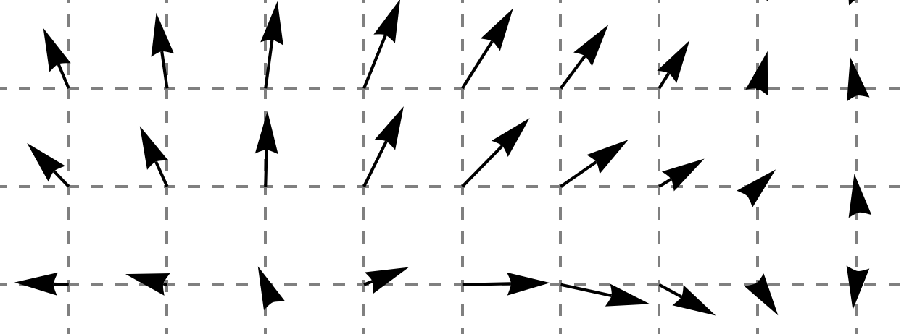
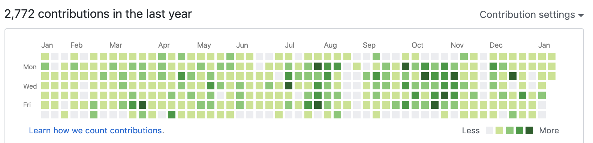

> "Every person in your company is a vector. Your progress is determined by the sum of all vectors."
>
> — Elon Musk

As tech founder, and as your startup grows, you might start getting questions like "it's not clear what the direction is". Your most meaningful work will go from being about "building feature X" to "making sure other people are empowered to build X". This is a very personal story about that transition.

I thought I was prepared. After all, I was the first hire at a startup that was scaled to 30 people in under 2 years, where I transitioned from coding the first version of everything to being in a leadership position. I had often seen brilliant coders forced into leadership positions, sometimes revealing that they were lousy leaders. I thought this would serve me as an example and as a guiding principle of how not to do things. But this would be different.

## It all changes when you're the founder

As a founder, my level of perfectionism rose dramatically. This is partly due to how I lived through crucial moments of the company where our collective actions amount to the difference between life and death of the organisation. I recall very specific moments where our strategy decisions turned out to be pivotal, like for example the decision to change our product offering, or when we decided to build a consumer app.

The decisions and motivations surrounding such pivotal moments emerge from the guts of the founder able to muster enough strength to trust their feelings and take a leap of faith. In my experience, they often involve working very hard at building something very quickly to test an idea. Nothing speaks more than an MVP where someone says "woaw, did you just build THAT? It gives me so many ideas!". Nothing beats showing a working prototype: it enables people to realise that something that previously looked complicated actually isn't, or that something previously thought as impossible actually isn't. Those reactions are hard to replicate in traditional organisations, because they require some sort of survival-level motivation: when you have your back against the wall, that's where you give your best.

When you have lived through a few of those experiences, it changes your expectations and tolerance levels. It turned me into a highly effective builder: I would show my prototype to as many people as possible and iterate extremely fast. But as with many things in life, there's no free lunch: you don't become a highly effective builder without  downsides.

## Over-optimising for the wrong thing

Getting good at building things yourself invariably means that you'll spend a lot of hours alone, learning your craft, and learning shortcuts and tips and tricks that will only work for you. In early startup days where you're coding most things, you might lack the ability to work in a team, to teach others about those tips and tricks. That's because you've become so effective that both your patience  and tolerance for incompetence is drastically reduced. You just become annoyed when someone doesn't "get it" immediately. It's not arrogance: it's just that you have lost sight of where others are, and that others need time to absorb the context that you're taking for granted.

A few weeks ago, the situation was that I still owned everything tech. That had been the case since the beginning, 4 years ago: I was personally coding and training Machine Learning models, writing scientific articles, maintaining our whole cloud infrastructure, building devops tools to have continuous testing and release, coding most of consumer app in React Native, fixing bugs and dealing with technical customer requests. Basically I was both building features and fixing anything raised by someone shouting "it doesn't work" - all of this while also raising money, making public appearances to raise awareness about our company, and building a team. That's not how you build a company (it's a good recipe for burnout though), and I knew it had to change.

There's not many days without a code contribution. Heck not even many Sundays without a commit!

## Wait but why?
A reasonable question to ask is why did it come to this? Why did nothing happen before? I believe I was underestimating how much drain it put on me. I'm known to my friends and family to be too optimistic about the things I can achieve. I think I overestimated my capacity to do tech, and underestimated the gains if I let someone else do it.

I sought to build a team that would complement my weaknesses. The people who joined me early on are specialists in design, business development and growth marketing (areas that were less known to me). Instead, I should have made sure to [fire myself](https://techcrunch.com/2012/08/28/first-fire-thyself/) from my job, and empower someone else to take over. That would have meant hiring a software engineer and a data scientist early on.

I feel that I should have known better given my previous experience. It turns out that as a founder, it's hard to let go of the things you believe are the most critically linked to the survival of the organisation. The quality delivered will inevitably go down. Features will get developed slower. It turns out that it's ok, because the goal is not necessarily to go fast -- it's to go far.

> Alone you go fast, but together, you go further.

## The bigger question
Most technical founders at this stage would be forced to become CEOs although they're not necessarily a good fit. They might end up micro-managing or unable to sufficiently let go of their responsibilities to give newcomers to space they need to feel agency. I've seen this several times, and I know this is not easy. I also knew I had a choice, and I wanted to make a very conscious choice here.

In a nutshell, two paths were offered to me:

1. Hire a people person who knows how to build teams and communicate effectively across the organisation. I could then focus on what I'm good at: building products (and prototypes).
2. Transition into a leadership position, and let go of my ability to build products myself. Instead, I should seek pleasure from empowering others to build products and to succeed. I should strive to be selfless, and to let go of frustrations that come as you lose your grip on the implementation. I should resist the urge to just do it myself because "I could quickly build/fix this".

Put differently: Should I build products, or should I build teams? I looked at those two options from the prism of what I believe I'm good at, what I want to learn, and what I gain pleasure from. Then I came across this excellent [article](https://techcrunch.com/2012/08/28/first-fire-thyself/) which opened my eyes with this quote: "as the founding CEO, you're one of the very, very few people who can hold the whole business in your head". I realised that I've always tried to hold the whole business in my head, as my goal has always been to have an impact. I also realised that this was something that I enjoyed.

This lead me to carve out a path for me that meant delegate most of tech. In the span of a few weeks, I had removed most of my coding tasks by a combination of temporary help (freelancers) and new hires. It opened up a decent amount of free time, where I was able to gather and digest all of our ideas, filter them and communicate more clearly to the team what our direction should be in terms of business and impact.

## Letting go

It is incredibly hard to let go of skills that have taken decades to perfect. I used to look down at CEOs who stopped coding. "Such a waste", I would think to myself. I now realise that the set of problems to be solved is different, but the building skills remain useful: they allow to identify development shortcuts and to make more informed decisions. They also allow to get the buy-in from the team.

In the end I think a CEO's role is to inspire others and to provide clarity of direction. The transition is painful however. You'll be alone and lost. I hope you'll feel less alone after having read that. If you also have a similar experience, feel free to reach out!
